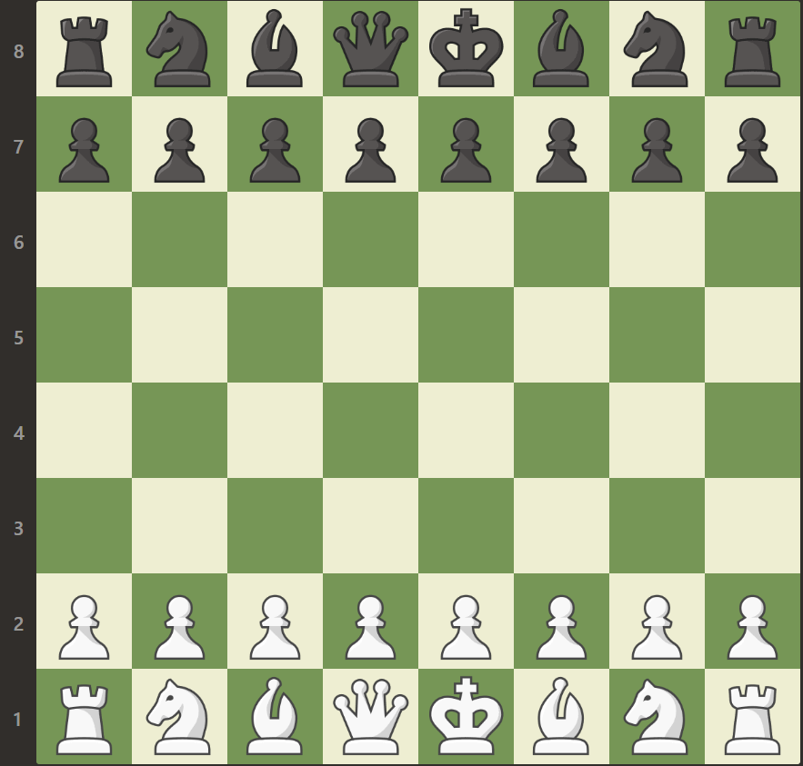

## Notation of the diffrent states

see more

- E = Empty
- bK = black king
- wK = white king
- bQ = black queen
- wQ = white queen
- bP = black pawn
- wP = white pawn
- bR = black rook
- wR = white rook
- bN = black knight
- wN = white knight
- bB = black bishop
- wB = white bishop

## Example

This is how the standard setup of a chess game would translate:  

Line 8: | bR | bN | bB | bQ | bK | bB | bK | bR |
--------|----|----|----|----|----|----|----|----|
Line 7: | bP | bP | bP | bP | bP | bP | bP | bP |
Line 6: | E  | E  | E  | E  | E  | E  | E  | E  |
Line 5: | E  | E  | E  | E  | E  | E  | E  | E  |
Line 4: | E  | E  | E  | E  | E  | E  | E  | E  |
Line 3: | E  | E  | E  | E  | E  | E  | E  | E  |
Line 2: | wP | wP | wP | wP | wP | wP | wP | wP |
Line 1: | wR | wN | wB | wQ | wK | wB | wK | wR |

Turning that into a single string the result would look like this:

`8.bR,bN,bB,bQ,bK,bB,bN,bR,7.bP,bP,bP,bP,bP,bP,bP,bP,6.E,E,E,E,E,E,E,E,5.E,E,E,E,E,E,E,E,4.E,E,E,E,E,E,E,E,3.E,E,E,E,E,E,E,E,2.wP,wP,wP,wP,wP,wP,wP,wP,1.wR,wN,wB,wQ,wK,wB,wN,wR`
 

- There are no free spaces inbetween, just a comma ,
- After every line-number is a dot .

This string is your chessboard setup.

## Advices

see more

1. Extenting your chessboard setup with custom text/numbers(anything) is highly recommended to increase your entropy.
    - To provide some instructions, which make it less unlikley you mess up a recovery, please enter your extention as follows:
    - YourBoard+YourExtention
    - Use the `+` for inbetween and don't have any empty space in your extention.
2. Don't use the default chessboard setup or common chess-openings as your entropy. Its very likley they get brute forced.
3. You are not limited to the rules of chess. Have 20 Kings on the board. Or style your board in any way you like it to.

